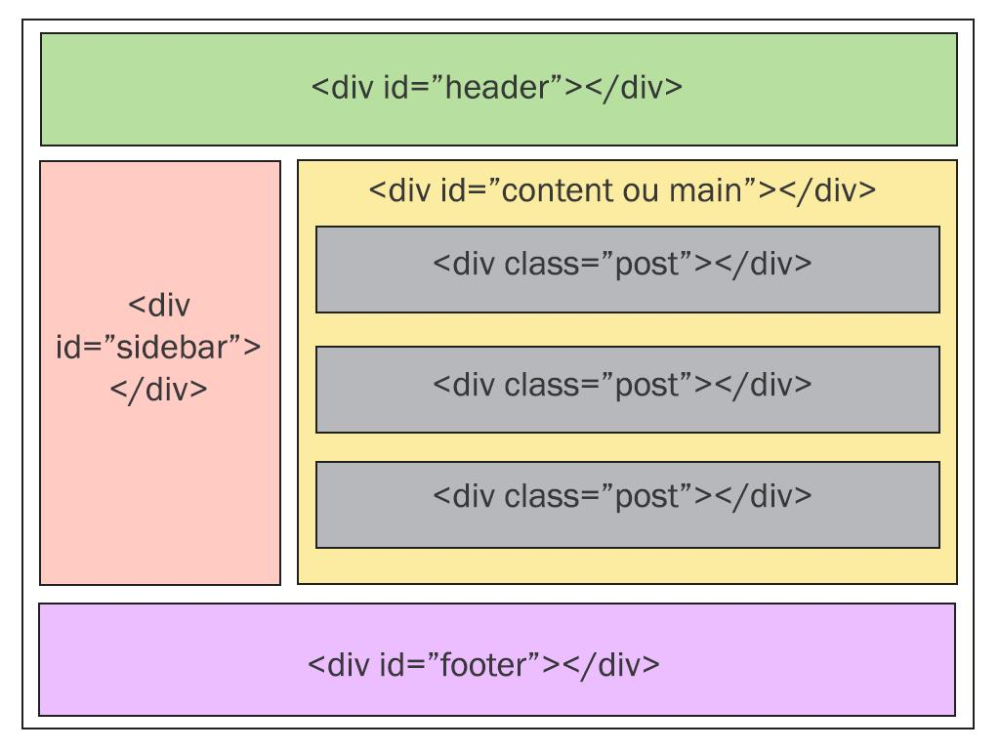
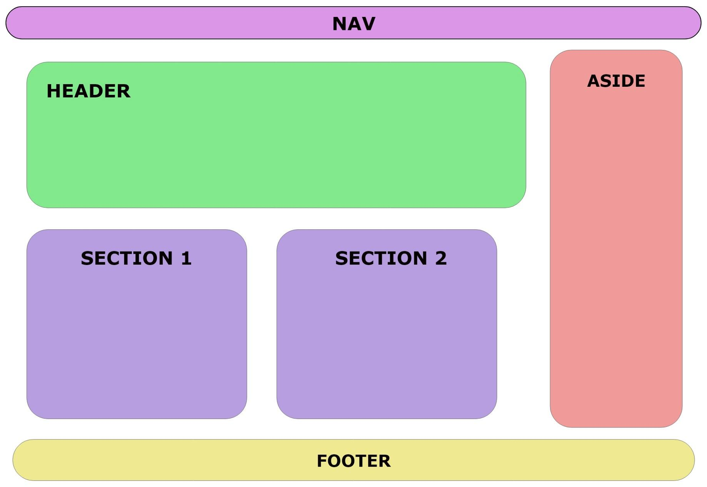

# HTML

> aprende
1. dokumento estruturado
2. textu tags no kontent
3. semantic html

> ``h1``-``h6`` ne'e hanesan heading(titulu) sira iha html

> ``

`` ne'e hanesan tag paragrafu hodi ita bele hakerek testu sira ne'ebe barak.

> `` `` 

> ```` hodi halo link

> ``img`` hodi ita bele aumena imagen

> ``<ul></ul>`` unordered list, nia sei sai bullet

> ``<li></li>`` list item hodi halo list

> ``<ol></ol>`` ordered list hodi halo list sai ordem ho numeru(1,2,3)

> ``

`` division hanesan block kontain, iha div ne'e iha attribute

> ```` hanesan bele aumenta style iha text ruma

> ``<header></header>`` parte ida iha pagina nia leten

> ``<nav></nav>`` - fatin navigasaun sira hodi rai menu sira

> ``<aside></aside>`` - hodi halo side bar

> ``<main></main>`` contain prinsipal iha pagina.

> ``<section></section>`` fahe contain sira sai parte parte

> ``<footer></footer>`` parte ida ne'ebe iha okos

> ``<form></form>`` hodi halo formulario ne'ebe sei iha nia tag ``<input>``.
